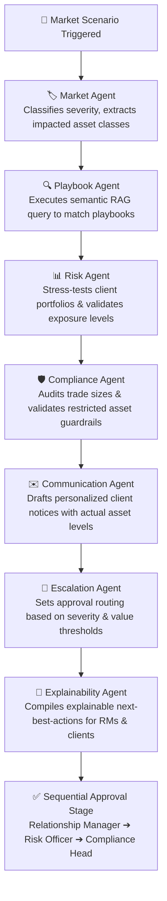

<<<<<<< Updated upstream
# PlayBook_AI

=======
# 🛡️ Sentinel AI — Playbook Platform

[](https://github.com/your-repo)
[](https://fastapi.tiangolo.com)
[](https://nextjs.org)
[](https://www.docker.com)

Welcome to **Sentinel AI**, a premium, state-of-the-art **Institutional Wealth Management Scenario Responder & AI Playbook Generator**. 

Sentinel AI empowers investment advisory firms, risk officers, and compliance departments to define, simulate, and systematically execute structured playbooks for different critical market events. It automates portfolio-level stress testing, audits compliance boundaries, drafts personalized client notices, and enforces multi-stage approvals.

---

## ⚡ Core Multi-Agent Orchestration Flow (7-Step Pipeline)

Sentinel AI utilizes a comprehensive, cooperative **six-agent pipeline** that coordinates scenario analysis, RAG matching, portfolio stress auditing, and client personalization in seconds:



---

## 🌟 Key Features

*   **📚 Pre-Seeded Institutional Library**: Loaded with highly descriptive playbooks for all **9 critical scenarios**:
    *   *Equity Market Crash* — Defensive rebalancing, SPY hedging options.
    *   *Sector Correction* — Concentrated tech reduction, rotating to value.
    *   *Interest Rate Change* — fixed income duration tuning, floating notes.
    *   *Liquidity Stress* — Cash buffer accumulation, spread management.
    *   *Earnings Volatility* — Hedges individual corporate reporting volatility.
    *   *Geopolitical Event* — Safe-haven reallocation (USD, Gold), tariff audits.
    *   *Credit Downgrade* — Reducing high-yield corporate debt exposure.
    *   *Client Panic Selling* — Psychological support workflow and portfolio floors.
    *   *Portfolio Concentration Breach* — Resolving asset exposure cap violations.
*   **🧠 Six-Agent RAG Orchestrator**: Runs RAG searches to map events, audits portfolios against explicit risk checks, and generates compliance-audited responses.
*   **✨ AI Playbook Studio & Generator**: A premium frontend workspace allowing advisors to prompt new playbooks (e.g. *"Middle East escalation impacting crude oil logistics"*), preview structured JSON drafts in glassmorphic tabs, customize individual actions, and save them instantly to the live library.
*   **🛡️ Multi-Stage RBAC & Approvals**: Complete Role-Based Access Control enforcing proper workspace isolation for **Relationship Managers**, **Risk Officers**, and **Compliance Heads**.

---

## 📂 Project Architecture

```text
├── ai-engine/               # ML Sandbox folder (models, datasets, experiments)
├── apps/
│   ├── api/                 # Python FastAPI Backend service
│   │   ├── src/             
│   │   │   ├── services/ai/ # Cooperative multi-agent orchestration files
│   │   │   ├── seed_db.py   # Seeding script with the 9 core playbooks
│   │   │   └── main.py      # FastAPI server entry point
│   │   └── requirements.txt # Python dependency declarations
│   └── web/                 # Next.js & React Frontend client
│       └── src/app/         # Playbook Studio and interactive dashboard files
├── setup.py                 # Cross-platform interactive setup coordinator
├── Makefile                 # Development command shortcuts
└── docker-compose.yml       # Production-ready docker deployment configs
```

---

## 🚀 Quick Start — Localhost Setup in One Command

We provide a zero-configuration, cross-platform **Python Setup Coordinator** that automatically builds virtual environments, installs Python/Node dependencies, and seeds the SQLite database.

### 1. Prerequisites
Ensure you have the following installed on your machine:
*   [Python 3.8+](https://www.python.org/downloads/)
*   [Node.js 18+](https://nodejs.org/)

### 2. Standard Setup Command
Run the setup coordinator from the root folder:
```bash
python setup.py
```
This script handles the heavy lifting:
*   Creates python virtual environment (`apps/api/venv`) and installs pip packages.
*   Auto-recreates local database tables and seeds the library of 9 pre-loaded playbooks.
*   Installs root and frontend Node dependencies.
*   Verifies system integrity.

### 3. Shortcut Development Commands (Makefile)
If your system supports `make`, you can use the following root shortcuts:
*   `make setup` — Starts the interactive setup coordinator.
*   `make start-backend` — Starts the FastAPI backend at `http://127.0.0.1:8000`.
*   `make start-frontend` — Starts the Next.js client at `http://localhost:3000`.
*   `make run-tests` — Runs all end-to-end integration and API tests.
*   `make reset-db` — Resets tables and re-seeds all playbooks.

---

## 👥 Demo Role-Based Credentials

To test the multi-stage RBAC workspace and sequential approvals pipeline, use the pre-configured demo credentials:

| Persona | Demo Username | Password | Key Capabilities |
|---|---|---|---|
| **Relationship Manager** | `rm@sentinel.ai` | `Sentinel2026!` | Client view, personalize notices, RM approval stage |
| **Risk Officer** | `risk@sentinel.ai` | `Sentinel2026!` | Define playbooks, trigger scenarios, risk audits |
| **Compliance Head** | `compliance@sentinel.ai` | `Sentinel2026!` | Manage guardrails, audit trades, final clearance |

---

## 🐳 Docker Deployment & Portability

Sentinel AI is fully containerized and compatible with Docker. It can be easily deployed on staging/production environments or on different machines using:

```bash
docker-compose up --build
```

*   **Portability Resilience**: The database layer is designed to attempt PostgreSQL connection using `DATABASE_URL` first. If PostgreSQL is offline or unreachable, the system automatically falls back to an isolated local SQLite `sentinel.db` database, ensuring a flawless hackathon demonstration on *any* laptop.
*   **AI Offline Mock Fallback**: If `OPENAI_API_KEY` is not present in `.env`, the orchestrator activates its built-in offline intelligence system. It outputs highly formatted playbooks and agent traces dynamically, guaranteeing a responsive presentation anywhere.

---

## 🧪 Integration Testing Suite
To verify backend routing, authorization, AI RAG selection, risk calculations, and approval flows, run:
```bash
make run-tests
```
*(All 14 integration test stages check RM blocks, Risk Officer creation, and Compliance Head pending clearances with a 100% success rate).*
>>>>>>> Stashed changes
